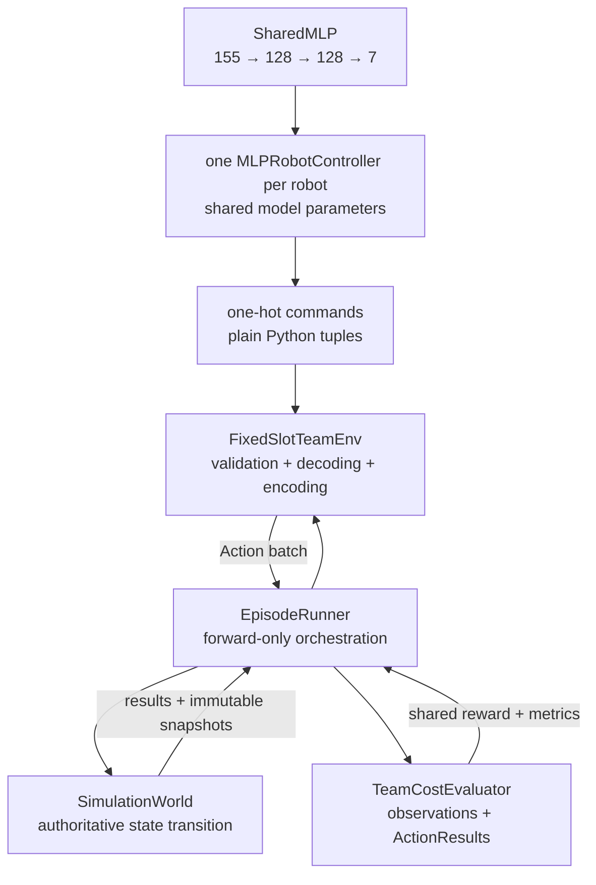

# Grid World and Controller Integration Guide

This guide describes the repository as inspected, with emphasis on how the
grid-world transition engine connects to robot controllers through the
session layer. It is written for a reader familiar with Python 3.11 and
Pygame but unfamiliar with this project.

> **Scope inference:** the request did not identify separate "main" and
> "second" code locations. In this guide, **main code** means the grid-world
> core in `src/multi_agent_sim/world.py` plus its action/entity model, and
> **second code** means the controller layer in
> `src/multi_agent_sim/controllers.py`, connected by
> `src/multi_agent_sim/session.py`. That is the separation present in the
> implementation.

## 1. Purpose and overview

The project is a small deterministic, discrete 2D multi-agent simulator. Its
central design rule is that decision-making and state mutation are separate:

- A controller receives a read-only snapshot and chooses an `Action`.
- A `SimulationSession` gathers one action for every robot and owns playback
  history.
- `SimulationWorld` validates and applies the entire batch, charges battery,
  updates occupancy and inventory, and returns structured results.
- A headless caller or the Pygame application initiates stepping and consumes
  the resulting state.

The main code areas and the problems they solve are:

| Code area | Responsibility | Problem solved |
|---|---|---|
| `src/multi_agent_sim/actions.py` | Defines actions, battery-cost configuration, failure categories, and transition results. | Gives every caller one stable transition vocabulary and result format. |
| `src/multi_agent_sim/entities.py` | Defines `Entity`, `Robot`, `Item`, `DeliveryDestination`, positions, battery, and one-item inventory. | Keeps entity identity and mutable state consistent under world ownership. |
| `src/multi_agent_sim/world.py` | Owns the authoritative state, occupancy index, collision rules, battery accounting, pickup/drop, and batched transitions. | Makes a multi-robot tick deterministic and prevents GUI/controller code from mutating only part of the state. |
| `src/multi_agent_sim/controllers.py` | Defines immutable observations, per-robot and joint controller protocols, registry/factories, and built-in policies. | Lets rule-based, planning, learned, or team policies plug in without depending on `SimulationWorld` internals. |
| `src/multi_agent_sim/session.py` | Defines initial scenarios, constructs controllers, asks for actions, records history/warnings, and rebuilds on rewind. | Bridges controllers to the forward-only world while providing exact Back/Forward navigation. |
| `src/multi_agent_sim/generation.py` | Builds a seeded random world directly. | Offers a lightweight convenience path when controller selection and timeline history are not needed. |
| `src/multi_agent_sim/episode.py` | Scores observation/result transitions and runs forward-only episodes. | Adds reward, cost, success, and timeout without putting objective policy in the world or replay session. |
| `src/multi_agent_sim/training_env.py` | Encodes fixed slots and validates one-hot team commands. | Gives learning code a stable dependency-free boundary around an episode. |
| `src/multi_agent_sim/learning.py` | Defines the optional shared PyTorch MLP and REINFORCE helpers. | Keeps tensors, gradients, training, evaluation, and checkpoints out of simulation code. |
| `src/multi_agent_sim/controller_catalog.py` | Discovers and validates immutable saved-controller model/manifest pairs. | Makes catalog inspection safe and deterministic without importing Torch. |
| `src/multi_agent_sim/saved_mlp_controllers.py` | Adapts a catalog MLP to the session controller protocol. | Keeps model loading and one-hot-to-`Action` conversion at the optional integration boundary. |
| `src/multi_agent_sim/visualization/` | Provides widgets, the setup/playback application, and a separate minimal renderer. | Keeps Pygame optional and keeps rendering outside the core transition engine. |
| `examples/` | Contains ordinary simulation, scored-episode, and MLP training/evaluation commands. | Provides separate composition roots for each architectural block. |
| `tests/` | Verifies core rules, controllers, replay, UI events, and CLI behavior. | Defines the executable behavioral contract and catches cross-layer regressions. |

The simulation, external scoring, and encoding layers have no runtime
dependencies. Pygame, PyTorch/NumPy, and pytest are optional extras declared in
`pyproject.toml`.

## 2. Architecture

### Component relationships

```mermaid
flowchart TD
    CLI["examples/basic_simulation.py<br/>main() / run_demo()"]
    App["PygameSimulationApp<br/>setup + 60 FPS UI loop"]
    Setup["InitializationState<br/>validation + preview"]
    ScenarioFactory["create_initial_scenario()"]
    DirectFactory["generate_random_world()<br/>standalone helper"]
    Scenario["InitialScenario<br/>immutable initial specification"]
    Session["SimulationSession<br/>controllers + timeline"]
    Registry["ControllerRegistry<br/>keys + factories"]
    Controller["RobotController /<br/>MultiAgentControllerAdapter"]
    Observation["WorldObservation<br/>immutable DTO"]
    World["SimulationWorld<br/>authoritative transitions"]
    Domain["Action / ActionResult<br/>Robot / Item / Destination / battery costs"]
    Renderer["PygameRenderer<br/>standalone read-only renderer"]

    CLI -->|visual defaults| App
    CLI -->|headless settings| ScenarioFactory
    App --> Setup
    Setup -->|validated values| ScenarioFactory
    ScenarioFactory --> Scenario
    Scenario -->|passed to constructor| Session
    Session -->|create_world() on start/rewind| Scenario
    Session -->|create key + context| Registry
    Registry -->|controller instance| Session
    Session -->|from_world()| Observation
    Observation -->|same snapshot + robot_id| Controller
    Controller -->|one Action| Session
    Session -->|dict robot_id to Action| World
    World -->|dict robot_id to ActionResult| Session
    World --> Domain
    App -.->|read-only rendering/status| World
    DirectFactory --> World
    Renderer -.->|read-only rendering| World
```

The only controller-to-world route in normal session execution is:

```text
caller/UI
  -> SimulationSession.step_forward()
  -> SimulationSession._generate_action_batch()
  -> RobotController.choose_action(WorldObservation, robot_id)
  -> SimulationWorld.step(dict[str, Action])
  -> dict[str, ActionResult]
```

Controllers do not receive a `SimulationWorld` or live entity
objects, the session, or an `ActionResult`. They can observe the effect of a
previous choice only in the next `WorldObservation`.

### Important types and responsibilities

#### Domain model

- `Action` in `src/multi_agent_sim/actions.py` is a string-valued enum with
  four movement actions plus `PICK_UP`, `WAIT`, and `DROP`.
- `ACTION_DELTAS` maps every action to an `(dx, dy)`. Nonmovement actions map
  to `(0, 0)`.
- `ActionBatteryCosts` is frozen and slotted. Its fields, in positional order,
  are `movement`, `pickup`, `wait`, and `drop`; defaults are `1`, `1`, `0`,
  and `1`. Values must be finite, non-Boolean, nonnegative numbers.
- `ActionResult` is a frozen per-robot record containing success/failure,
  start/end positions, battery before/after/spent, and picked-up or dropped
  item IDs. `picked_item_id` is a compatibility alias for
  `picked_up_item_id`.
- `Entity` makes position publicly read-only and uses owner-checked internal
  methods so only the owning world moves it.
- `Robot` adds a stable ID, nonnegative finite battery, and a read-only
  `carried_item_id`. Inventory capacity is one ID.
- `Item` is passive and contains only an ID and a position.
- `DeliveryDestination` is a persistent floor marker containing a globally
  unique destination ID, position, and target item ID. Its empty, correct, or
  incorrect status is derived from the item occupying its cell.

#### World

`SimulationWorld` in `src/multi_agent_sim/world.py` owns:

- `_entities: dict[str, Entity]`, a global ID registry across all entity types;
- `_occupancy: dict[Position, set[str]]`, the spatial index;
- `_reserved_item_ids: dict[str, str]`, mapping an off-grid carried item ID to
  its carrier robot ID;
- dimensions, an `OccupancyPolicy`, immutable action costs, and `_timestep`.

Its public query methods return entities sorted lexicographically by entity
ID. The default `TypeExclusiveOccupancyPolicy` allows robots and items to
occupy a destination cell, but rejects two entities of the same type in one
cell. Only one destination may target a given item ID.

`add_entity()`, `remove_entity()`, and `move_entity()` are administrative APIs.
They maintain registry and occupancy invariants, but `move_entity()` does not
charge battery or advance simulation time. Robot behavior should normally use
`step()` instead.

#### Scenario and session

- `RobotConfiguration` stores a robot's initial position, battery, and
  `controller_key`. Tuple order determines automatic IDs `robot_1`,
  `robot_2`, and so on.
- `InitialScenario` is the immutable, validated initial specification. Its
  semantically required `delivery_destination_positions` contains exactly one
  position per item; tuple order maps `destination_n` to `item_n`. The explicit
  `initially_delivered_items` count permits that many leading matching
  item/destination pairs to share their initial cells.
  `create_world()` always creates fresh entities at timestep zero.
- `create_initial_scenario()` uses a local `random.Random(seed)`. In random
  mode it samples unique robot and item cells. In manual mode it preserves
  robot positions/batteries and samples item cells excluding robot cells. It
  then keeps leading initially delivered destinations on their items and
  samples the remaining destinations from free cells. Required capacity is
  `robots + 2 * items - initially_delivered_items`.
- `SimulationSession` owns the current world, controller instances, action
  history, controller-warning history, history cursor, rate, maximum steps,
  and play state.

#### Controllers

- `RobotObservation`, `ItemObservation`, `DeliveryDestinationObservation`, and
  `WorldObservation` are frozen, slotted DTOs. `WorldObservation.from_world()`
  copies public state into sorted tuples and includes dimensions, world
  timestep, and `ActionBatteryCosts`.
- `RobotController` is a runtime-checkable structural protocol whose only
  method is `choose_action(observation, robot_id) -> Action`.
- `ControllerRegistry` maps a stable key and display name to a factory. Each
  factory receives `ControllerFactoryContext(seed, robot_id)`.
- `RandomController` owns a private seeded RNG and samples uniformly from
  `tuple(Action)`, including pickup/drop attempts that may fail.
- `NearestItemController` uses Manhattan distance, breaks equal-distance ties
  by item ID, moves horizontally before vertically, and chooses `PICK_UP` when
  co-located. It waits when loaded, when no items exist, or when it cannot
  afford its intended action.
- `MultiAgentControllerAdapter` wraps one joint `choose_actions()` policy as
  the per-robot protocol and caches the complete team decision once per
  value-distinct observation.

### Entry points and initialization sequence

There is no installed console-script declaration in `pyproject.toml`. The
executable entry is `examples/basic_simulation.py`:

1. `main()` calls `build_parser()` and then `run_demo(args)`.
2. `run_demo()` creates `ActionBatteryCosts` from the four CLI cost flags.
3. In visual mode it validates `--fps` as 1-30, lazily imports
   `PygameSimulationApp`, passes the CLI values as setup defaults, and calls
   `run()`.
4. In headless mode it calls `create_initial_scenario()`, constructs a
   `SimulationSession`, and invokes `step_forward()` exactly `--steps` times.
   With no controller keys supplied, every robot uses `random`; `--fps` is
   ignored.

The visual branch continues as follows:

1. `PygameSimulationApp.__init__()` chooses the supplied registry or creates
   the default registry, copies its definitions into setup selector choices,
   and creates `InitializationState` and the widgets.
2. `initialize()` starts Pygame and creates the resizable window, fonts, clock,
   and first layout.
3. `run()` processes events, updates simulation time, and renders at a UI rate
   capped at 60 frames per second.
4. `InitializationState.validate()` parses and validates dimensions, counts,
   seed, maximum steps, all four costs, controller keys, capacity, and manual
   robot coordinates/batteries.
5. `preview_scenario()` caches the matching `InitialScenario`. Switching to
   manual mode initially seeds manual rows from the random preview; Reroll
   changes the seed while retaining controller choices.
6. `_start_simulation()` creates `SimulationSession` with that scenario,
   maximum, rate, and the same registry. A newly constructed session is
   paused at cursor zero.
7. Play or Forward eventually calls `session.step_forward()`. Rendering reads
   `session.world`; it never advances the world itself.

Both renderers draw destinations beneath items and robots: purple means empty,
amber means occupied by the wrong item, and green means the target item is
present. The playback status also reports fulfilled destinations as a
delivered/total count.

`src/multi_agent_sim/__init__.py` re-exports the public core/controller/session
API without importing Pygame. Visualization is opt-in through
`src/multi_agent_sim/visualization/__init__.py`.

### Pygame scheduling and timeline controls

`PygameSimulationApp.run()` uses `Clock.tick(_UI_FPS)` with `_UI_FPS = 60`,
then processes events, calls `update(elapsed_seconds)`, renders, and flips the
display. `update()` is the only automatic mutation path:

1. While paused it clears the elapsed-time accumulator and does not step.
2. While playing it accumulates real time and computes
   `interval = 1 / session.step_rate`.
3. It calls `session.step_forward()` for each complete interval, with a cap of
   120 steps in one frame to avoid an unresponsive catch-up spiral.
4. Reaching `max_steps` pauses the session and clears the accumulator.

Back and Forward events pause first, perform exactly one session operation,
and clear accumulated time. The rate slider writes
`SimulationSession.step_rate`; it does not change the 60 FPS UI limit. New
Setup pauses and discards the current session/history while retaining the
existing `InitializationState` fields and controller selections, plus the
latest rate. `_draw_simulation()` and `_draw_world()` only read state. The
right status panel reads current battery/inventory/controller names and the
current step's controller-warning mapping.

## 3. How the grid-world code works

### Coordinate, occupancy, and identity assumptions

- Coordinates are exact `tuple[int, int]` values. Booleans are rejected even
  though Python treats `bool` as an `int` subclass.
- `(0, 0)` is top-left, `x` grows right, and `y` grows down.
- Bounds are `0 <= x < width` and `0 <= y < height`.
- Entity IDs are global across robots, items, and delivery destinations.
- Initial scenario generation places every entity on a unique cell, which is
  stricter than the default runtime policy allowing robot/item/destination
  overlap.
- Entity queries and transition application use lexicographic ID order, so
  `robot_10` sorts before `robot_2`.

### `SimulationWorld.step()` execution flow

`SimulationWorld.step()` is the authoritative transition function (currently
starting at `src/multi_agent_sim/world.py:177`). One call performs these steps:

1. **Validate the supplied batch.** `_validate_actions()` accepts `None` or a
   mapping from known robot IDs to actual `Action` enum values. Unknown IDs,
   item IDs, and non-`Action` values fail before any state change, battery
   charge, or timestep increment.
2. **Complete and snapshot the batch.** Every registered robot participates.
   An omitted robot receives `WAIT`. The world records start positions,
   starting batteries, costs, selected actions, and movement targets.
3. **Preflight battery and movement.** Insufficient battery is checked first.
   Affordable nonmovement actions skip geometry checks. A movement target must
   be in bounds and permitted by the occupancy policy against the occupants at
   the start of the tick.
4. **Resolve movement conflicts.** If multiple otherwise-valid movers target
   one cell, every contender fails with `CONFLICT`. A robot cannot move into a
   cell occupied by another robot at tick start even if that robot also moves
   away during the tick.
5. **Apply in sorted robot-ID order.** Successful movement updates both entity
   position and occupancy. `WAIT` changes no spatial state. Pickup/drop use
   the item rules below.
6. **Charge battery.** Every affordable attempt is charged its configured
   cost, including attempts that fail at a boundary, collision, missing item,
   full/empty inventory, or blocked drop. Only
   `INSUFFICIENT_BATTERY` spends nothing. Exact-cost actions are allowed and
   may reduce battery to zero.
7. **Create results and advance time.** The world creates one `ActionResult`
   per robot, increments `timestep` exactly once, and returns
   `dict[str, ActionResult]`. An empty-world step still advances time.

Movement is resolved from a start-of-tick snapshot. Pickup and drop are
different: they are executed during the sorted apply pass and therefore see
earlier item mutations in that pass. Under the default policy, robots cannot
co-locate, so this usually does not matter. Under a custom policy that permits
robot co-location, same-cell item interactions can become lexicographic
robot-ID-order dependent.

### Pickup, drop, and carried-ID reservation

`PICK_UP` operates on the robot's current cell:

- No item produces `NO_ITEM`. This check occurs before the full-inventory
  check.
- A present item plus an already-carried item produces `INVENTORY_FULL`.
- Success removes the first lexicographically sorted item from the world,
  stores its ID on the robot, and reserves that ID in `_reserved_item_ids`.

`DROP` also operates on the current cell:

- Empty inventory produces `NO_CARRIED_ITEM`.
- An existing item or occupancy-policy rejection produces `OCCUPIED`.
- Success constructs a new `Item` with the carried stable ID at the current
  position, registers it, clears the robot inventory, and removes the ID
  reservation.

The dropped object is a new Python `Item` instance, not the object removed by
pickup. This is currently harmless because `Item` has only ID and position,
but it matters if item subclasses or metadata are added later.

Delivery uses these existing pickup/drop rules. A destination is empty with no
item on its cell, fulfilled when the occupying item ID equals its
`target_item_id`, and incorrectly occupied otherwise. Either item blocks a
second drop, and a later pickup empties the destination. Destinations remain
registered throughout these transitions.

### Representative core operation: pickup

Assume `robot_1` and `item_1` share `(1, 0)`, the robot has battery `3`, and
pickup costs `3`:

```python
results = world.step({"robot_1": Action.PICK_UP})
result = results["robot_1"]
```

The call follows this exact path:

1. `_validate_actions()` confirms `robot_1` is a robot and the value is
   `Action.PICK_UP`.
2. The cost snapshot is `3`. Because battery is exactly `3`, the action is
   affordable.
3. `_items_at((1, 0))` returns `item_1`.
4. `remove_entity("item_1")` removes it from `_entities` and `_occupancy` and
   unbinds it from the world.
5. `Robot._store_item()` writes `carried_item_id="item_1"` under owner guard,
   and the world reserves the off-grid ID for `robot_1`.
6. `_spend_battery(3)` reduces the battery to `0`.
7. The returned `ActionResult` has `success=True`, equal start/end positions,
   `battery_before=3`, `battery_after=0`, `battery_spent=3`, and
   `picked_up_item_id="item_1"`. The world timestep increases by one.

If battery were below `3`, the result would be
`INSUFFICIENT_BATTERY`, no item or inventory state would change, and no battery
would be spent. If the action were affordable but the item absent, the world
would return `NO_ITEM` and still spend `3`.

## 4. How controllers connect to the world

The connection is implemented in `SimulationSession`, not in
`SimulationWorld`. The key locations are:

- `SimulationSession.__init__()` in `src/multi_agent_sim/session.py` creates
  the world and one controller per auto-generated robot ID.
- `SimulationSession.step_forward()` chooses between new action generation
  and recorded replay.
- `SimulationSession._generate_action_batch()` constructs one observation and
  invokes controllers.
- `SimulationWorld.step()` consumes the assembled action mapping.

### Construction boundary

For each robot, session construction reads
`RobotConfiguration.controller_key` and calls:

```python
registry.create(
    controller_key,
    ControllerFactoryContext(seed=scenario.seed, robot_id=robot_id),
)
```

The default registry derives a stable per-robot random seed from the scenario
seed and robot ID with SHA-256 rather than Python's process-randomized
`hash()`. Factories therefore receive deterministic context, and normally
each robot receives a distinct controller instance.

`controller_overrides` bypass registry construction. This is how richer
objects are injected and how one `MultiAgentControllerAdapter` instance is
shared across all members of a team.

### Runtime boundary and data format

At the action-history tip, `_generate_action_batch()` performs the boundary
crossing:

| Direction | Initiator | Data crossing the boundary | Format |
|---|---|---|---|
| World to session | Session | Public world state copied into a snapshot | `WorldObservation` |
| Session to controller | Session | Same snapshot plus the current robot ID | `choose_action(observation, robot_id)` |
| Controller to session | Controller return | One requested action | `Action` enum member |
| Session to world | Session | Completed batch for every robot | `dict[str, Action]` |
| World to caller/session | World return | Actual transition outcomes | `dict[str, ActionResult]` |
| Session to UI | UI reads | Latest controller-side warning strings | read-only `Mapping[str, str]` |

All controllers for a tick receive the same `WorldObservation` instance and
are called synchronously in lexicographically sorted robot-ID order. The
observation contains:

- `width`, `height`, and world `timestep`;
- sorted tuples of `RobotObservation` values with ID, position, battery, and
  carried item ID;
- sorted tuples of on-grid `ItemObservation` values with ID and position;
- immutable action battery costs.

It deliberately omits mutable world/entity objects, occupancy-policy details,
session play/cursor/history state, previous `ActionResult`s, rewards, and
controller-specific configuration.

### Failure handling at the boundary

Controller failures and world action failures are separate channels:

- If `choose_action()` raises an `Exception`, or returns anything other than
  an `Action`, session substitutes `Action.WAIT`, records a string such as
  `"RuntimeError: model unavailable"`, and continues collecting the batch.
- That fallback `WAIT` is a normal world action. It spends the configured Wait
  cost when affordable and can itself return `INSUFFICIENT_BATTERY`.
- Bounds, collision, battery, pickup, and drop failures are returned in
  `ActionResult.failure_reason`; they are not controller warnings.
- Registry lookup errors, factory errors, invalid factory results, observation
  construction errors, and exceptions from `world.step()` are not converted
  to Wait. They propagate to the caller.
- A joint adapter requires exactly one valid `Action` for every configured
  team ID. Missing, extra, or invalid entries invalidate the joint result. The
  adapter caches that failure for the snapshot, and session converts each
  member's raised error to Wait.

There is no post-action callback. A controller learns whether an action
succeeded only by comparing a later observation, unless the embedding code
supplies an out-of-band feedback mechanism.

### History, rewind, and controller state

New batches are appended to two aligned lists:

- `_action_history: list[dict[str, Action]]`
- `_controller_error_history: list[dict[str, str]]`

The public accessors return copies wrapped in read-only mapping proxies.
`ActionResult`s are not retained by the session.

When the cursor is behind the history tip, `step_forward()` reuses the stored
action and warning batch and does not call any controller. `step_back()`
pauses, calls `InitialScenario.create_world()`, and replays recorded action
batches up to one step before the old cursor. This reconstructs positions,
battery, items, inventory, and timestep without mutating private world state.

Controller objects are not rewound. Because recorded replay suppresses
controller calls and the timeline does not branch, a stateful controller's
call count remains positioned at the history tip. This design assumes that
controller state advances through action-generation calls and that any
external dependency it uses remains suitable when new history is generated.

## 5. Runtime example

This example follows the tested Nearest Item path in a 3-by-1 world:

```python
from multi_agent_sim import (
    ActionBatteryCosts,
    InitialScenario,
    RobotConfiguration,
    SimulationSession,
)

scenario = InitialScenario(
    width=3,
    height=1,
    robot_configurations=(
        RobotConfiguration((0, 0), 7, controller_key="nearest_item"),
    ),
    item_positions=((2, 0),),
    seed=4,
    action_battery_costs=ActionBatteryCosts(movement=2, pickup=3),
    delivery_destination_positions=((1, 0),),
)
session = SimulationSession(scenario, max_steps=3)
```

Construction creates `robot_1` at `(0, 0)` with battery `7`, `item_1` at
`(2, 0)`, `destination_1` at `(1, 0)` targeting `item_1`, and a
`NearestItemController` from the default registry. The session is paused at
cursor/timestep zero.

The three calls have this order and state effect:

| Call | Controller decision | World operation | State after the call |
|---|---|---|---|
| `session.step_forward()` at step 0 | Nearest item is right, so `MOVE_RIGHT` | Movement is valid; spend 2 | Robot `(1, 0)`, battery 5; item remains `(2, 0)`; cursor/timestep 1 |
| `session.step_forward()` at step 1 | Target still right, so `MOVE_RIGHT` | Robot may share the item cell; spend 2 | Robot and item at `(2, 0)`, battery 3; cursor/timestep 2 |
| `session.step_forward()` at step 2 | Co-located, so `PICK_UP` | Remove item, reserve its ID, store inventory; spend 3 | Robot `(2, 0)`, battery 0, carrying `item_1`; no on-grid items; cursor/timestep 3 |

For each new step, the internal call order is:

```text
SimulationSession.step_forward()
  -> SimulationSession._generate_action_batch()
  -> WorldObservation.from_world(session.world)
  -> NearestItemController.choose_action(observation, "robot_1")
  -> SimulationWorld.step({"robot_1": selected_action})
  -> append action/warning history
  -> increment cursor and return ActionResult mapping
```

Now call `session.step_back()` from cursor 3. The session creates a fresh world
from `scenario`, replays only the first two recorded `MOVE_RIGHT` batches, and
sets cursor 2. The restored state is robot `(2, 0)`, battery `3`, empty
inventory, with `item_1` still on-grid at `(2, 0)`.

Calling `session.step_forward()` again replays the recorded `PICK_UP` batch.
It does not invoke `NearestItemController`; it reproduces battery `0`, carried
`item_1`, the removed on-grid item, and the recorded warning state. Only after
the cursor reaches the history tip can another Forward/Play generate a new
controller decision, subject to `max_steps`.

## 6. Extension guide

### Add a per-robot controller

Implement the small protocol, register a factory under a stable key, use that
key in the scenario, and pass the same registry to the session:

```python
from multi_agent_sim import (
    Action,
    SimulationSession,
    WorldObservation,
    create_default_controller_registry,
    create_initial_scenario,
)


class ReturnHomeController:
    def choose_action(
        self,
        observation: WorldObservation,
        robot_id: str,
    ) -> Action:
        robot = observation.get_robot(robot_id)
        if robot.carried_item_id is not None:
            if robot.position == (0, 0):
                return Action.DROP
            return Action.MOVE_LEFT if robot.position[0] > 0 else Action.MOVE_UP
        return Action.WAIT


registry = create_default_controller_registry()
registry.register("return_home", "Return Home", lambda context: ReturnHomeController())

scenario = create_initial_scenario(
    width=8,
    height=8,
    num_robots=1,
    num_items=2,
    seed=42,
    controller_keys=("return_home",),
)
session = SimulationSession(scenario, controller_registry=registry)
```

Return an `Action` enum member, not its string value. A registry factory gets
the scenario seed, robot ID, and session `max_steps`; close over other
model/configuration dependencies or inject a fully constructed controller
through `controller_overrides` when more context is needed.

For a planner, RL policy, or neural network, keep conversion code inside the
controller adapter: transform `WorldObservation` into the model's input,
invoke it, and map the output back to `Action`. Calls are synchronous and have
no timeout, so slow inference blocks the headless loop or Pygame UI.

To expose a custom controller in the GUI, register it **before** constructing
`PygameSimulationApp` and pass the registry to the app. The setup selectors
copy registry definitions during app construction; later registry additions
do not refresh existing selectors. Saved catalog controllers are the exception:
the explicit reload action replaces those choices. The CLI's `--controller`
option accepts a built-in key or saved controller ID; loading other custom
controller code still requires programmatic registry construction.

### Add a joint multi-agent controller

Implement `choose_actions(observation, robot_ids)`, create one
`MultiAgentControllerAdapter`, and pass that same adapter object as the
override for every team member:

```python
team_ids = ("robot_1", "robot_2")
adapter = MultiAgentControllerAdapter(team_policy, team_ids)
session = SimulationSession(
    scenario,
    controller_overrides={robot_id: adapter for robot_id in team_ids},
)
```

Do not create one adapter per robot: each adapter has its own cache, which
would cause repeated joint-policy evaluation. The tuple order supplied to the
adapter is policy-facing, while session controller calls use lexicographic ID
order.

### Add a new action

This is a tightly coupled extension. Review all of these locations together:

1. Add the enum member and delta in `src/multi_agent_sim/actions.py`.
2. Decide its battery-cost category or add a validated
   `ActionBatteryCosts` field and update `cost_for()`.
3. Update the nonmovement/preflight and apply branches in
   `SimulationWorld.step()`.
4. Add failure reasons and `ActionResult` fields if the action needs them.
5. Decide whether `RandomController` should sample it. It currently samples
   every enum member automatically, so adding or reordering members also
   changes seeded random action streams.
6. Propagate configuration through scenario, CLI, setup fields, and UI status
   where applicable.
7. Add world, session replay, controller-observation, CLI, and UI tests.

If a new action is omitted from `ACTION_DELTAS`, target calculation fails. If
`ActionBatteryCosts.cost_for()` is not updated, a new nonmovement action can
silently fall through to the Wait cost.

### Add entity state, item metadata, or occupancy behavior

- Update `entities.py`, then ensure all mutation remains world-owned so
  `_entities` and `_occupancy` stay synchronized.
- Update `WorldObservation.from_world()` and the DTOs if controllers must see
  the new state.
- Update `InitialScenario.create_world()` so rewind reconstructs it.
- Update pickup/drop if metadata must survive carrying. Drop currently creates
  a new base `Item` from only the stable ID and current position.
- A custom `OccupancyPolicy` can be supplied to a direct `SimulationWorld`,
  but `InitialScenario`/`SimulationSession` do not currently carry a custom
  policy. Add it to the immutable scenario if it must survive rewind.
- Drop explicitly rejects an existing item before consulting the policy, so a
  custom policy alone cannot enable item stacking on drop.

### Preserve timeline correctness

Treat `session.world` as read-only outside normal observation/rendering even
though it is publicly accessible. Administrative additions, removals, moves,
or direct `world.step()` calls are not recorded in session history and are
lost or contradicted on rewind.

Rewind is rebuild-and-replay, making one Back operation O(cursor). The default
maximum of 200 keeps that bounded, but callers may configure much larger
values. If histories become large, consider checkpoints rather than exposing
private state mutation.

Stateful controllers work with the nonbranching timeline because replay does
not call them. Controllers backed by mutable remote state, wall-clock time, or
nondeterministic services need their own reproducibility strategy if exact
continuation after replay matters.

### Extend the UI or renderer

- Add setup fields, validation, and propagation in
  `visualization/pygame_app.py` together; a displayed field that is not part of
  `SetupConfiguration` will never reach the scenario/session.
- Add reusable input behavior in `visualization/widgets.py` and test both
  mouse and keyboard paths.
- `PygameSimulationApp.update()` is the only automatic stepping location. Keep
  mutation out of `_draw_simulation()` and `_draw_world()`.
- World drawing is duplicated in `PygameSimulationApp._draw_world()` and the
  standalone `PygameRenderer`. Visual changes may need to be made twice.
- `PygameRenderer.fps` limits render-loop frames; it is not the same setting as
  `SimulationSession.step_rate`, which schedules simulation ticks.

### Tests and commands

Install development and visualization dependencies:

```powershell
python -m pip install -e ".[visualization,dev]"
```

Run the complete suite:

```powershell
python -m pytest
```

The tests use `unittest` APIs and can also run with:

```powershell
python -m unittest discover -s tests -v
```

Useful focused runs are:

```powershell
python -m pytest tests/test_world.py tests/test_battery_pickup.py
python -m pytest tests/test_controllers.py tests/test_session.py
python -m pytest tests/test_pygame_app.py tests/test_widgets.py
python -m pytest tests/test_demo.py
```

`tests/test_pygame_app.py` and `tests/test_widgets.py` set SDL's dummy video
and audio drivers before importing Pygame, and skip when the visualization
extra is absent. `tests/test_demo.py` launches the example in a subprocess to
exercise the actual headless CLI path.

### Verified unclear, unused, or incomplete connections

The following observations are directly established by call-site searches
unless marked **inference**:

- **Scope ambiguity:** "Relevant locations" was blank. The main/second-code
  interpretation at the top of this guide is an inference from the actual
  dependency boundary.
- `generate_random_world()` is public, documented, and tested, but neither CLI
  branch nor the Pygame app calls it. The active demo path uses
  `InitialScenario` plus `SimulationSession`.
- `PygameRenderer` is public but is not used by `PygameSimulationApp` or the
  example. It is a standalone embedding path with separate world-drawing code;
  destination rendering is smoke-tested alongside the application.
- `run_pygame_application()` is a public, tested convenience wrapper, but the
  example constructs `PygameSimulationApp` directly.
- `create_world_observation()` is public and tested, but session production
  code calls `WorldObservation.from_world()` directly.
- `SimulationSession.latest_controller_errors` is a compatibility alias with
  no repository caller.
- Headless CLI execution accepts `--controller` to initialize every robot with
  a built-in registry key or saved controller ID. Arbitrary custom registries
  still require programmatic construction.
- `NearestItemController` intentionally remains item-only: it waits forever
  after pickup and never chooses `DROP`, even though destinations are visible
  in its observation.
- The session stores action and controller-warning history but not
  `ActionResult` history. Pygame shows controller warnings, not ordinary world
  failure reasons; an embedding caller must inspect each `step_forward()`
  return immediately if it needs them.
- The GUI snapshots ordinary registry changes during construction. Its
  **Reload controllers** action explicitly rescans saved manifests and
  preserves every still-valid per-robot selection.
- Controller action-time exceptions are isolated, but an unknown controller
  key or failing factory during `SimulationSession` construction propagates.
  `PygameSimulationApp._start_simulation()` does not convert that startup
  failure into an inline setup error.
- A custom registry without the `random` key cannot construct scenarios whose
  robot configurations retain the default controller key; callers must set
  every key or provide overrides.
- Observations omit the active occupancy policy and prior outcomes. A
  collision-aware controller must assume known rules, infer them, or receive
  extra configuration out of band. The built-in nearest-item policy can
  repeatedly pay for a blocked move.
- **Inference:** because pickup/drop execute sequentially while movement is
  snapshot-resolved, custom policies allowing robot co-location may expose
  same-cell item-operation ordering by lexicographic robot ID.
- Invalid action mappings are rejected transactionally, but there is no
  general rollback around arbitrary policy code. **Inference:** a custom
  occupancy policy that raises during a later robot's Drop can leave mutations
  already applied for earlier robots while the tick itself does not complete.
- `robot_id`, `item_id`, and `destination_id` attributes are publicly writable even while the
  world's registry is keyed by their old value. **Inference:** changing an ID
  in place can desynchronize registry/occupancy invariants; callers should
  treat registered IDs as immutable.
- A session exposes its live world. **Inference:** external world mutation can
  make current state disagree with recorded history and will not survive a
  rebuild on Back.

## 7. File map

| File | Responsibility | Why you may need to edit it |
|---|---|---|
| `pyproject.toml` | Python version, package discovery, optional visualization/training/dev extras, pytest settings. | Change packaging, dependency ranges, supported Python, or add a console script. |
| `README.md` | User-facing install, run, API, world-semantics, and controller examples. | Keep public behavior and commands aligned with implementation changes. |
| `examples/basic_simulation.py` | Ordinary visual/headless simulation entry point. | Add CLI settings, controller-loading support, or alter demo defaults/summary. |
| `examples/scored_episode.py` | Scripted headless episode with external objective reporting. | Demonstrate or smoke-test cost and reward independently of learning. |
| `examples/train_mlp.py` | Curriculum training and checkpoint evaluation CLI. | Configure training, evaluation, devices, masks, or artifact locations. |
| `examples/visualize_mlp_controller.py` | Saved-policy inference loop with optional Pygame rendering. | Watch greedy or stochastic one-hot controllers without coupling learning to the simulator. |
| `src/multi_agent_sim/__init__.py` | Public core/controller/session re-exports. | Expose or retire a supported public API without importing Pygame into the core. |
| `src/multi_agent_sim/actions.py` | `Action`, deltas, costs, failures, and `ActionResult`. | Add or change actions, charging categories, or result data. |
| `src/multi_agent_sim/entities.py` | Entity ownership, positions, robot battery/inventory, items, and delivery destinations. | Add entity state/types or change inventory capacity while preserving owner guards. |
| `src/multi_agent_sim/world.py` | Entity registry, occupancy, transition resolution, battery, pickup/drop, and timestep. | Change simulation rules, occupancy behavior, conflicts, or action effects. |
| `src/multi_agent_sim/controllers.py` | Observation DTOs, protocols, registry, built-ins, stable seeding, and joint adapter. | Add observable state, controller types, factory behavior, or team-policy integration. |
| `src/multi_agent_sim/session.py` | Scenario validation/creation, controller construction, action generation, history, replay, and playback state. | Change initialization, controller orchestration, timeline behavior, checkpoints, or error recording. |
| `src/multi_agent_sim/generation.py` | Direct seeded random-world convenience factory. | Change the lightweight no-session generation path or keep it aligned with new world configuration. |
| `src/multi_agent_sim/episode.py` | Observation/result-only team cost evaluator and forward-only episode runner. | Change objective weights, metrics, reward, or episode termination. |
| `src/multi_agent_sim/training_env.py` | Fixed 4/8 slot encoder, action masks, one-hot conversions, and training wrapper. | Change the model-facing schema without coupling it to Torch. |
| `src/multi_agent_sim/learning.py` | Optional shared MLP, per-robot learned controllers, REINFORCE curriculum, evaluation, and checkpoints. | Change learning behavior without changing simulation or scoring. |
| `src/multi_agent_sim/controller_catalog.py` | Dependency-free controller manifests, discovery, checksum validation, and atomic publication. | Change the on-disk controller catalog contract without importing Torch. |
| `src/multi_agent_sim/saved_mlp_controllers.py` | Optional shared model runtime and session-facing learned-policy adapter. | Change saved-policy inference, devices, masks, or session conversion. |
| `src/multi_agent_sim/visualization/__init__.py` | Explicit Pygame-facing exports. | Add/remove public visualization adapters. |
| `src/multi_agent_sim/visualization/pygame_app.py` | Setup form, validation, preview, app events, elapsed-time scheduler, timeline toolbar, status, and responsive drawing. | Add GUI configuration, controller selection/status, keyboard behavior, or interactive playback features. |
| `src/multi_agent_sim/visualization/pygame_renderer.py` | Standalone read-only direct-world renderer and simple frame limiter. | Embed a world without the setup/session UI or keep standalone visuals consistent with the app. |
| `src/multi_agent_sim/visualization/widgets.py` | Buttons, text input, integer slider, choice selector, palette, and text helpers. | Add reusable Pygame controls or change input/accessibility behavior. |
| `tests/test_world.py` | World construction, registry, occupancy, administrative moves, movement snapshots/conflicts, and transactional action validation. | Update/add tests for core movement or occupancy semantics. |
| `tests/test_battery_pickup.py` | Cost validation/accounting, pickup/drop, inventory, and carried-ID reservation. | Update/add tests for battery and item interaction rules. |
| `tests/test_entities.py` | Entity validation, read-only positions, and world ownership. | Cover new entity state and ownership invariants. |
| `tests/test_generation.py` | Random-world reproducibility, capacity, unique cells, RNG isolation, and cost propagation. | Cover changes to the direct generation helper. |
| `tests/test_controllers.py` | DTO immutability/order, registry/factories, built-ins, Drop visibility, and multi-agent caching/validation. | Validate new observation fields, controllers, seeds, or adapters. |
| `tests/test_session.py` | Scenario rules, controller context/fallback, history, rewind/replay, pickup/drop reconstruction, and shared adapters. | Validate orchestration and replay-safe behavior. |
| `tests/test_pygame_app.py` | Dummy-display setup, controls, scheduler, field propagation, selectors, warnings, scrolling, and minimum layout. | Validate app-level interactions or update tests after UI layout/refactoring. |
| `tests/test_widgets.py` | Dummy-display mouse/keyboard behavior, focus, clipping, slider, and selector validation. | Validate reusable widget changes. |
| `tests/test_demo.py` | Subprocess smoke tests for the real CLI, headless run, FPS rule, and cost flags. | Validate entry-point and argument changes end to end. |
| `tests/test_episode.py` | Observation-only objective, progress, battery, success, and timeout behavior. | Validate reward/cost changes independently of controllers and visualization. |
| `tests/test_training_env.py` | Fixed-slot rows, masks, one-hot validation, and wrapper behavior. | Validate the dependency-free learning boundary. |
| `tests/test_learning.py` | MLP, REINFORCE, curriculum replay/recovery, and checkpoint behavior. | Validate optional Torch learning and exact CPU continuation. |
| `tests/test_learning_examples.py` | Scoring, training, evaluation, and visual-runner CLI smoke tests. | Validate the separate public composition roots. |
| `tests/test_controller_catalog.py` | Publication, discovery validation, deduplication, shared loading, and optional-Torch behavior. | Validate saved controllers independently of training continuation artifacts. |

## 8. External scoring and learning path

The training path is a second composition path, not an extension of
`SimulationSession`:



The dependency direction is one-way: the world and replay session do not
import the episode, environment, or learning modules. The evaluator never
receives a live world. It verifies consecutive immutable observations and the
per-robot action results, then uses actual `battery_spent` values for energy.
It computes a route potential and delivered fraction from the same snapshots.
For each item, the route is zero when delivered, carrier-to-destination while
carried, or nearest-robot-to-item plus item-to-destination while uncarried.

### Objective lifecycle

`TeamCostEvaluator(initial_observation, max_steps, cost_weights)` establishes
the fixed robot, item, and destination rosters and `E_max`. Each
`evaluate_transition(previous, next, results)` call validates a single tick,
computes the shared reward, and returns current `EpisodeMetrics`.
The returned transition exposes `item_progress_reward`, `delivery_reward`, and
an immutable decomposition of every reward component. Metrics expose the
initial/current normalized route potential, delivered fraction, cumulative
signed `item_progress_cost`, and `delivery_cost`. Route progress is
`item_progress_weight * (R_previous - R_next)`. Delivery credit is
`delivery_weight * (Q_next - Q_previous)`. Moving away or removing an item
from its own destination is penalized symmetrically, so reversible route and
delivery cycles net zero.

`EpisodeRunner` performs this wiring for an `InitialScenario`. Unlike
`SimulationSession`, it has no controllers, fallback actions, history, replay,
or UI state. Callers must supply exactly one `Action` per robot. It checks
success after the transition and before timeout, and refuses further steps
after termination.

The ordinary example composition checks the same observation-only delivery
helper after each team step. It stops new forward execution on success without
adding termination policy to `SimulationWorld` or `SimulationSession`; the
Pygame timeline can still move Back and replay the successful transition.

The undiscounted sum of rewards is exactly the negative accrued/final cost.
REINFORCE defaults to `gamma=1`; choosing a smaller gamma changes the learning
return and therefore breaks that equality, without changing reported episode
cost or cumulative raw reward.

### Model boundary

`FixedSlotEncoder` repeats one global 151-value encoding for each present robot
and appends that robot's four-way identity, producing four rows of 155 values.
Robot and logical-item slots are stable for the episode; a carried item keeps
its original item slot and uses its carrier's position and identity. Presence
flags distinguish real slots from zero padding.

Learned controllers alone use one-hot commands. Existing rule-based
`RobotController` implementations continue to return `Action`. Each
`MLPRobotController` returns exactly one immutable seven-value command while
keeping its differentiable log-probability and entropy within the optional
learning module. `FixedSlotTeamEnv` validates and decodes the complete command
mapping before the simulator sees it.

The advisory learned-policy mask excludes `Pick Up` when the colocated item is
already at its own destination. This protection is outside the world: pickup
remains a valid simulator action and can still be issued by an unmasked or
rule-based controller.

### Curriculum and checkpoint lifecycle

The default curriculum has eight stages: 4x4/1 robot/1 item; a 4x4/1 robot/2
item bridge with item 1 initially delivered; the original 4x4/1 robot/2 item
problem; 5x5/1 robot/2 items; 6x6/2 robots/2 items; 8x8/2 robots/4 items;
10x10/4 robots/4 items; and 12x12/4 robots/8 items. The pre-delivered bridge
teaches the model to preserve one completed delivery while seeking the second
item. Normal training replays a uniformly selected completed earlier stage
with probability 0.4. Evaluation below the 0.8 retention threshold puts the
trainer into recovery mode on the earliest regressed stage; only that stage is
sampled until prior-stage evaluation recovers.

`shared_mlp_best.pt` is a model-only inference artifact selected by held-out
performance. `shared_mlp_latest.pt` is a full training bundle saved atomically
after each optimizer update. It contains model and Adam state,
Python/Torch/CUDA random state where applicable, counters, curriculum and
evaluation boundaries, recovery state, configuration, objective weights, and
format versions. Use `--initialize-from` to warm-start from a best checkpoint
and `--resume-from` to continue a latest bundle exactly. Resume compatibility
is checked before training begins.

The route-and-delivery reward and learned action mask use explicit schema
versions. Old model-only catalog entries remain inference-compatible because
the encoding and network architecture did not change. Old full training
bundles are not exact-resume compatible. The first protected-policy run should
therefore start from random weights and use distinct
`shared_mlp_protected_v3_best.pt` and `shared_mlp_protected_v3_latest.pt`
paths.

### Saved-controller catalog lifecycle

`artifacts/shared_mlp_latest.pt` remains a mutable full training bundle and
`artifacts/shared_mlp_best.pt` remains the mutable run-best inference state.
After each training invocation, the best state is copied into `controllers/`
under an informative unique filename. A matching `.controller.json` manifest
is the commit marker and records the run ID, architecture/schema versions,
qualification and validation result, counters, configuration, Torch version,
and model SHA-256. The model is written atomically before the manifest;
identical checksums are deduplicated.

`discover_saved_controllers()` uses only the dependency-free catalog module.
It scans manifests in deterministic order and rejects missing or modified
models, duplicate IDs, incompatible versions, and model paths outside the
catalog. `create_registry_with_saved_controllers()` is the optional Torch
boundary. It loads a catalog model lazily once, shares that model among every
robot using the entry, fixed-slot encodes each session observation with the
session's actual `T_max`, obtains a plain one-hot command, and converts that
command to `Action` only at the session adapter boundary.

Every `MLPRobotController` also retains a detached plain-Python
`PolicyDecision` for inspection: masked probabilities, legal mask, selected
action/index, entropy, and greedy/stochastic mode. These diagnostics do not
expose tensors or affect the differentiable distribution used by training.
`examples/visualize_mlp_controller.py` can render them beside the grid and
write full per-step traces with `--trace-report`.

The Pygame setup merges saved entries after Random and Nearest Item and permits
independent selection per robot. The reload action rescans the directory while
retaining valid selections. The ordinary headless CLI accepts the same saved
controller ID for all robots. Catalog policies default to greedy, masked CPU
inference and enforce the encoder limits of four robots and eight items.
